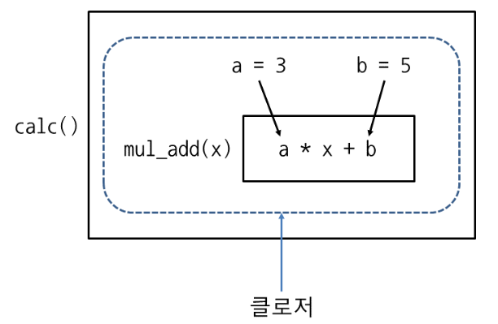

# 클로저 Closure
함수를 둘러싼 환경(지역 변수, 코드 등)을 계속 유지하다 함수를 호출할 때 다시 꺼내서 사용하는 함수

- 지역 변수와 코드를 묶어서 사용하고 싶을 때, 데이터를 숨기고 싶을 때 활용<br>
(클로저에 속한 지역 변수는 바깥에서 직접 접근할 수 없으므로)
```python  
def calc():
	a = 3
	b = 5
	def mul_add(x):
		return a * x + b # 함수 바깥쪽에 있는 지역 변수 a,b를 사용하여 계산
	return mul_add  # 함수 자체 반환 

c = calc() # 함수 mul_add가 변수 c에 할당됨 해당 함수를 클로저라 함

print(c(1), c(2), c(3), c(4), c(5)) # 8 11 14 17 20
```



### lambda + closure 
- lambda: 이름이 없는 익명 함수, 간단한 식으로 함수를 만들 때 사용
- closure: 함수를 둘러싼 환경을 유지했다가 나중에 다시 사용하는 함수
```python
def calc():
	a = 3
	b = 5
	return lambda x: a * x + b 

c = calc()
print(c(1), c(2), c(3), c(4), c(5)) # 8 11 14 17 20
```

### 클로저의 지역 변수 변경하기
- nonlocal : 클로저의 지역변수 변경
```python
def calc():
	a = 3
	b = 5
	total = 0
	def mul_add(x):
		nonlocal total
		total = total + a * x + b
		print(total)
	return mul_add

c=calc()
print(c(1), c(2), c(3))  # 8 19 33
```

---

### 일급 객체 First-class object
다음의 조건을 만족하는 객체

- 변수나 데이터 구조에 넣을 수 있어야 한다
- 매개변수에 전달할 수 있어야 한다
- 반환값으로 사용할 수 있어야 한다

### 일급 함수 First-class function
일급 객체의 조건을 만족하면서, 실행 중(Runtime)에 함수를 생성할 수 있는 함수<br>
(파이썬의 함수는 def안에 def로 함수를 만들거나, lambda를 사용하여 실행 중에 함수를 생성할 수 있으므로 일급 함수이다)
