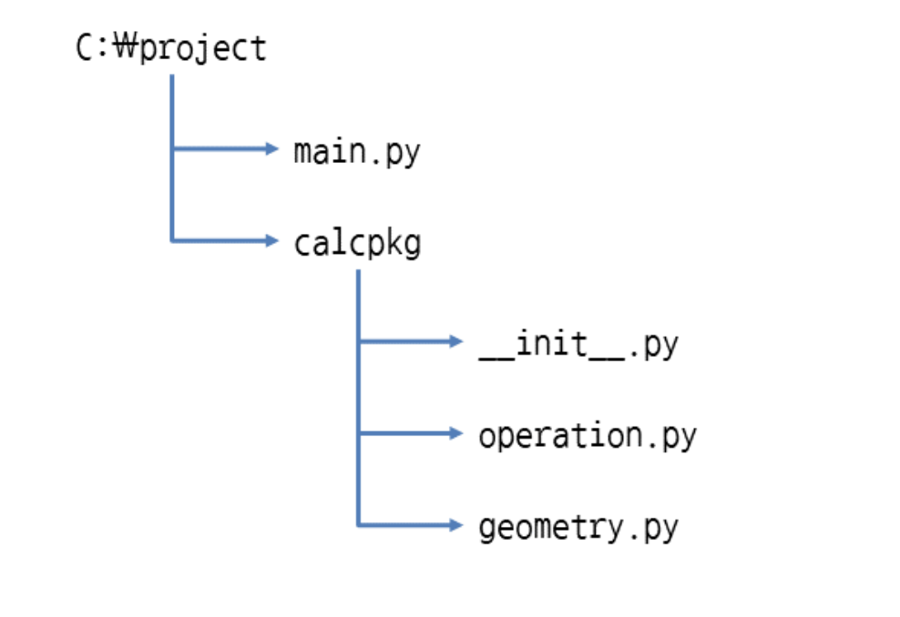

# Modules
- Module: 각종 변수, 함수, 클래스를 담고 있는 파일. 간단한 기능을 담을 때 사용
- Package
    - : 여러 모듈을 묶은 것(모듈에 namespace 제공). 코드가 많고 복잡할 때 사용
    - : 기능들이 모듈 여러 개로 잘게 나누어져 있고, 관련된 모듈끼리 폴더에 모여 있는 형태
- 파이썬 표준 라이브러리(PSL): python에 기본으로 설치된 모듈과 패키지, 내장함수를 묶어 PSL이라 부름

### import로 모듈 가져오기
- import 모듈
- import 모듈1, 모듈2
    - 모듈.변수
    - 모듈.함수()
    - 모듈.클래스()
=== "math-1"
    ``` python
    import math
    math.pi #3.141592653589793
    math.sqrt(4.0) #2.0
    ```
=== "math-2"
    ```python
    import math as m
    m.sqrt(4.0) #2.0
    ```
=== "math-3"
    ```python
    from math import pi, sqrt
    pi #3.141592653589793
    sqrt(4.0) #2.0
    ```
=== "math-4"
    ```python
    from math import *
    ```
- from 모듈 import (변수,함수,클래스) as 이름
```python
from math import sqrt as s
from math import pi as p, sqrt as s
```
- 가져온 모듈 해제하기, 다시 가져오기
``` python
## 해제하기
import math
del math

## 다시 가져오기
import importlib
import math
importlib.reload(math)
```

### import로 패키지 가져오기
- import 패키지.모듈
    - `import 패키지.모듈1, 패키지.모듈2`
    - `패키지.모듈.(변수, 함수(), 클래스()`
=== "표준 라이브러리 urllib 패키지의 request 모듈"
    ```python
    import urllib.request
    response = urllib.request.urlopen('http://www.google.co.kr')
    response.status #200
    ```
=== "others"
    ```python
    import urllib.request as r
    from urllib.request import Request, urlopen
    from urllib.requeset import *
    from urllib.request import Request as r, urlopen as u
    ```

### 모듈과 시작점
- `__name__`  : 모듈의 이름이 저장되는 변수 (import로 모듈을 가져왔을 때, 모듈의 이름이 들어감)
- `__main__` : 스크립트 파일을 직접 실행했을 때의 이름 <br>
(인터프리터가 최초로 실행한 스크립트 파일의 __name__)

### 모듈과 패키지 만들기
=== "square2.py"
    ```python
    base=2
    def square(n):
        return base**n

    class Person:    
        def __init__(self, name, age, address):
            self.name = name
            self.age = age
            self.address = address
    
        def greeting(self):
            print('안녕하세요. 저는 {0}입니다.'.format(self.name))
    ```
=== "main.py"
    ```python
    from square2 import base, square, Person
    print(base) # 2
    square(10) # 1024

    maria = Person('마리아', 20, '서울시 서초구 반포동')
    maria.greeting() #안녕하세요. 저는 마리아입니다.
    ```

### 패키지 만들기


=== "C:\project/main.py"
    ```python title="main.py"
    import calcpkg.operation    # calcpkg 패키지의 operation 모듈을 가져옴
    import calcpkg.geometry     # calcpkg 패키지의 geometry 모듈을 가져옴
    
    print(calcpkg.operation.add(10, 20)) #20   # operation 모듈의 add 함수 사용
    print(calcpkg.operation.mul(10, 20)) #200   # operation 모듈의 mul 함수 사용
    
    print(calcpkg.geometry.triangle_area(30, 40)) #600.0   # geometry 모듈의 triangle_area 함수 사용
    print(calcpkg.geometry.rectangle_area(30, 40)) #1200   # geometry 모듈의 rectangle_area 함수 사용

    from calcpkg.operation import add, mul
    add(10,20) #20 
    mul(10,20) #200
    ```
=== "C:\project/calcpkg/"
    ```python title="__init__.py"
    # 해당 파일이 존재할 시, 해당 폴더를 패키지로 인식 (3.3부터는 없어도 패키지로 인식함)
    ```
=== "/calcpkg/"
    ```python title="operation.py"
    def add(a, b):
        return a + b

    def mul(a, b):
        return a * b
    ```
=== "/calcpkg/"
    ```python title="geometry.py"
    def triangle_area(base, height):
        return base * height / 2

    def rectangle_area(width, height):
        return width * height
    ```

### 패키지에서 from import 응용하기
- 1
=== "C:\project/calcpkg/__init__.py_1"
    ```python
    from . import operation  # 현재 패키지에서 operation 모듈을 가져옴
    from . import geometry   # 현재 패키지에서 geometry 모듈을 가져옴

    # import로 패키지를 가져오면, init.py가 이 파일에서 현재 패키지 모듈을 가져와야함
    # . 은 현재 패키지라는 뜻
    ```
=== "C:\project/main.py_1"
    ```python
    import calcpkg    # calcpkg 패키지만 가져옴
    
    print(calcpkg.operation.add(10, 20))    # operation 모듈의 add 함수 사용
    print(calcpkg.operation.mul(10, 20))    # operation 모듈의 mul 함수 사용
    
    print(calcpkg.geometry.triangle_area(30, 40))    # geometry 모듈의 triangle_area 함수 사용
    print(calcpkg.geometry.rectangle_area(30, 40))   # geometry 모듈의 rectangle_area 함수 사용
    ```
- 2
=== "C:\project/calcpkg/__init__.py_2"
    ```python
    # 현재 패키지의 operation, geometry 모듈에서 각 함수를 가져옴
    from .operation import add, mul
    from .geometry import triangle_area, rectangle_area
    
    __all__=['', ''] ## 해당 패키지에서 공개하고 싶은 함수만 공개
    from .operation import *
    from .geometry import *
    ```
=== "C:\project/main.py_2"
    ```python
    from calcpkg import *    # calcpkg 패키지의 모든 변수, 함수, 클래스를 가져옴
    
    print(add(10, 20))    # operation 모듈의 add 함수 사용
    print(mul(10, 20))    # operation 모듈의 mul 함수 사용
    
    print(triangle_area(30, 40))    # geometry 모듈의 triangle_area 함수 사용
    print(rectangle_area(30, 40))   # geometry 모듈의 rectangle_area 함수 사용
    ```

### 하위/상위 패키지
- 하위패키지 `import 패키지.하위패키지.모듈`
- 상위패키지 `import 패키지.하위패키지.모듈`
- 상위폴더 접근 `..`
- 상위폴더의 상위폴더 접근 `...` (위로 갈수록 .이 하나씩 늘어난다)
- 독스트링
    - 파일 첫 줄에 ‘’’독스트링’’’ 사용하여 문자열 삽입
    - 출력할 때는 `모듈.__doc__`,  `패키지.__doc__`