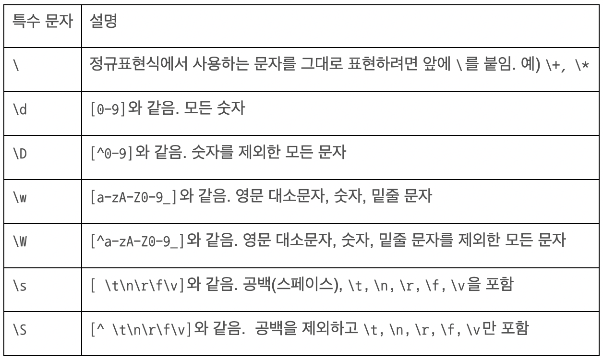
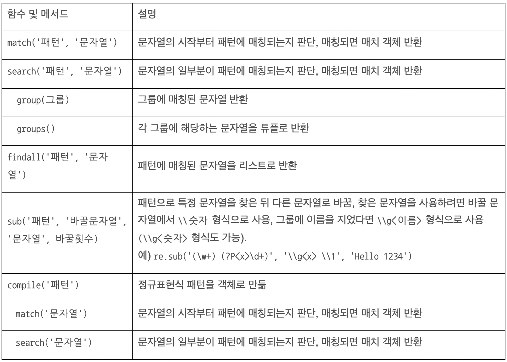

# Regular Expression
일정한 규칙을 가진 문자열을 표현하는 방법

- 복잡한 문자열 속에서 특정한 규칙으로 된 문자열을 검색한 뒤, 추출하거나 바꿀 때 사용
- 문자열이 정해진 규칙에 맞는지 판단할 때 사용

### 문자열 판단하기
- re.match(’패턴’, ‘문자열’)
```python
import re

re.match('Hello', 'Hello, world!') # <re.Match object; span=(0, 5), match='Hello'>
re.match('Hello', 'world!') # 반환되지 않음
```

### 문자열이 맨 앞 또는 맨 뒤에 오는 지 판단하기
- ^문자열
- 문자열$
```python
re.search('^Hello', 'Hello, world!') #<re.Match object; span=(0, 5), match='Hello'> 
re.search('^[A-Z]+', 'Hello') # <_sre.SRE_Match object; span=(0, 1), match='H'> # 대문자로 시작하므로 패턴에 매칭됨

re.search('world!$', 'Hello, world!') #<re.Match object; span=(7, 13), match='world!'> 
re.search('[0-9]+$', 'Hello1234') #<_sre.SRE_Match object; span=(5, 9), match='1234'> # 숫자로 끝나므로 패턴에 매칭됨
```

### 지정된 문자열이 하나라도 포함되는지 판단하기
- 문자열|문자열
- 문자열|문자열|문자열|문자열
```python
re.match('hello|world', 'hello') # <re.Match object; span=(0, 5), match='hello'> # hello 또는 world가 있으므로 패턴에 매칭됨
```

### 문자가 0~1개 이상 있는지 판단
- [0-9]*
- [0-9]+
: [ ] 대괄호 안에 숫자 범위 삽입
: *는 문자 또는 숫자가 0개 이상 있는지 확인
: +는 1개 이상 있는지 확인
``` python
# 1234는 0부터 9까지 숫자가 0개 이상 있으므로 패턴에 매칭됨
re.match('[0-9]*', '1234') # <re.Match object; span=(0, 4), match='1234'>

# 1234는 0부터 9까지 숫자가 1개 이상 있으므로 패턴에 매칭됨
re.match('[0-9]+', '1234') # <re.Match object; span=(0, 4), match='1234'>

re.match('[0-9]+', 'abcd') # abcd는 0~9까지 숫자가 1개 이상 없으므로 패턴에 매칭되지 않음
```

### 문자가 한 개만 있는지 판단
- 문자?
- [0-9]?
- .
: ?는 앞의 문자가 0개 또는 1개인지 판단
: .은 .이 있는 위치에 아무 문자가 1개 있는지 판단
```python
# abd에서 c 위치에 c가 0개 있으므로 패턴에 매칭됨
re.match('abc?d', 'abd') # <re.Match object; span=(0, 3), match='abd'>

# abd에서 c 위치에 c가 1개 있으므로 패턴에 매칭 안됨
re.match('abc?d', 'abc')

# [0-9] 위치에 숫자가 1개 있으므로 패턴에 매칭됨
re.match('ab[0-9]?c', 'ab3c') # <re.Match object; span=(0, 4), match='ab3c'>

# .이 있는 위치에 문자가 1개 있으므로 패턴에 매칭됨
re.match('ab.d', 'abxd') # <_sre.SRE_Match object; span=(0, 4), match='abxd'>
```

### 문자 개수 판단하기
- 문자{개수}
- (문자열){개수}
```python
# h가 3개 있는지 확인
re.match('h{3}', 'hhhello')  # <re.Match object; span=(0, 3), match='hhh'>

# hello가 3개 있는지 확인
re.match('(hello){3}', 'hellohellohelloworld') # <re.Match object; span=(0, 15), match='hellohellohello'>
```
- [0-9]{개수} : 특정 범위의 숫자가 몇 개 있는지 판단
```python
# 숫자 3개-4개-4개 패턴에 매칭됨
re.match('[0-9]{3}-[0-9]{4}-[0-9]{4}', '010-1000-1000') # <re.Match object; span=(0, 13), match='010-1000-1000'>
re.match('[0-9]{3}-[0-9]{4}-[0-9]{4}', '010-1000-100') # 숫자 3개-4개-4개 패턴에 매칭되지 않음 
```
- (문자){시작개수,끝개수}
- (문자열){시작개수,끝개수}
- [0-9]{시작개수,끝개수}
```python
re.match('[0-9]{2,3}-[0-9]{3,4}-[0-9]{4}', '02-100-1000') # <re.Match object; span=(0, 11), match='02-100-1000'>
```

### 숫자와 영문 문자를 조합해서 판단하기
- a-z
- A-Z
``` python
# a부터 z, A부터 Z, 0부터 9까지 1개 이상 있으므로 매칭
re.match('[a-zA-Z0-9]+', 'Hello1234') #<re.Match object; span=(0, 9), match='Hello1234'>
re.match('[A-Z0-9]+', 'hello') # 대문자, 숫자는 없고 소문자만 있으므로 패턴에 매칭되지 않음
```
- 가-힣
```python
# 가부터 힣까지 1개 이상 있으므로 패턴에 매칭됨
re.match('[가-힣]+', '홍길동') #<re.Match object; span=(0, 3), match='홍길동'>
```

### 특정 문자 범위에 포함되지 않는지 판단하기
- [^범위]*
- [^범위]+ : 범위 앞에 ^를 붙이면 해당 범위 제외
- `[^A-Z]+` : 는 대문자를 제외한 모든 문자(숫자)가 1개 이상 있는지 판단
``` python
re.match('[^A-Z]+', 'Hello') # 대문자를 제외. 대문자가 있으므로 패턴에 매칭되지 않음
re.match('[^A-Z]+', 'hello')  # <re.Match object; span=(0, 5), match='hello'>
```

### 특수문자 판단하기
- \특수문자 (단, []안에서는 \를 붙이지 않아도 됨)
```python
# *이 들어있는지 판단
re.search('\*+', '1 ** 2') #<re.Match object; span=(2, 4), match='**'>

# $, (, )와 문자, 숫자가 들어있는지 판단
re.match('[$()a-zA-Z0-9]+', '$(document)') #<re.Match object; span=(0, 11), match='$(document)'>
```

### 단순 정규표현식
- \d: [0-9]와 같음. 모든 숫자
- \D: [^0-9]와 같음. 숫자를 제외한 모든 문자
- \w: [a-zA-Z0-9_]와 같음. 영문 대소문자, 숫자, 밑줄 문자
- \W: [^a-zA-Z0-9_]와 같음. 영문 대소문자, 숫자, 밑줄 문자를 제외한 모든 문자
```python
re.match('\d+', '1234') # 모든 숫자이므로 패턴에 매칭됨
re.match('\D+', 'Hello') # 숫자를 제외한 모든 문자이므로 패턴에 매칭됨
re.match('\w+', 'Hello_1234') # 영문 대소문자, 숫자, 밑줄 문자이므로 패턴에 매칭됨
re.match('\W+', '(:)') # 영문 대소문자, 숫자, 밑줄문자를 제외한 모든 문자이므로 패턴에 매칭됨
```

### 공백 처리하기
- ‘ ‘
- \s : [ \t\n\r\f\v]와 같음.
- \S : [^ \t\n\r\f\v]와 같음. 공백을 제외하고 \t, \n, \r, \f, \v만 포함
``` python
re.match('[a-zA-Z0-9 ]+', 'Hello 1234') # ' '로 공백 표현
re.match('[a-zA-Z0-9\s]+', 'Hello 1234') # \s로 공백 표현
```

### 그룹 사용하기 (정규표현식)(정규표현식)
- 매치객체.group(그룹숫자)
``` python
m = re.match('([0-9]+) ([0-9]+)', '10 295')
m.group(1) # '10'  ## 첫 번째 그룹(그룹 1)에 매칭된 문자열을 반환
m.group(2) # '295'  ## 두 번째 그룹(그룹 2)에 매칭된 문자열을 반환
m.group() # '10 295' ## 매칭된 문자열을 한꺼번에 반환 
m.group(0) # '10 295' ## 매칭된 문자열을 한꺼번에 반환
```
- 매치객체.groups()  : 각 그룹에 해당하는 문자열을 튜플로 반환
```python
m.groups() # ('10', '295')
```
- (?P<이름>정규표현식)
- 매치객체.group(’그룹이름’)
``` python
m = re.match('(?P<func>[a-zA-Z_][a-zA-Z0-9_]+)\((?P<arg>\w+)\)', 'print(1234)')
m.group('func') #'print'
m.group('arg') # '1234'
```

### 패턴에 매칭되는 모든 문자열 가져오기
- re.findall(’패턴’, ‘문자열’) 
``` python
# 다음 문자열에서 숫자만 가져오기
re.findall('[0-9]+', '1 2 Fizz 4 Buzz Fizz 7 8') # ['1', '2', '4', '7', '8']
```

### 특정 문자열을 찾아 다른 문자열로 바꾸는 방법
- re.sub(’패턴’, ‘바꿀문자열’, ‘문자열’, 바꿀횟수)
``` python
# apple 또는 orange를 fruit로 바꿈
re.sub('apple|orange', 'fruit', 'apple box orange tree') # 'fruit box fruit tree'

# 숫자만 찾아서 n으로 바꿈
re.sub('[0-9]+', 'n', '1 2 Fizz 4 Buzz Fizz 7 8') # 'n n Fizz n Buzz Fizz n n'
```
- 교체함수(매치객체)
- re.sub(’패턴’, 교체함수, ‘문자열’, 바꿀횟수)

=== "def"
    ``` python
    def multiple10(m):  # 매개변수로 매치 객체를 받음
        n=int(m.group()) # 매칭된 문자열을 가져와서 정수로 변환
        return str(n*10) # 숫자에 10을 곱한 뒤 문자열로 변환해서 반환

    re.sub('[0-9]+', multiple10, '1 2 Fizz 4 Buzz Fizz 7 8')#'10 20 Fizz 40 Buzz Fizz 70 80'
    ```
=== "lambda"
    ``` python
    re.sub('[0-9]+', lambda m: str(int(m.group()) * 10), '1 2 Fizz 4 Buzz Fizz 7 8') # '10 20 Fizz 40 Buzz Fizz 70 80'
    ```

### 찾은 문자열을 결과에 다시 사용하기
- `({\s*)` : {와 공백을 찾음
- `(\s*})` : 공백과 }를 찾음
- `"(\w+)"`
- `"(\w+)"`
- 정규표현식을 그룹으로 묶기
- \\숫자
``` python
# 'hello 1234'에서 hello는 그룹 1, 1234는 그룹 2로 찾은 뒤 그룹 2, 1, 2, 1 순으로 문자열의 순서를 바꿔서 출력
re.sub('([a-z]+) ([0-9]+)', '\\2 \\1 \\2 \\1', 'hello 1234') # '1234 hello 1234 hello'

# { "name": "james" }'을 '<name>james</name>' 형식으로 바꿉니다.
re.sub('({\s*)"(\w+)":\s*"(\w+)"(\s*})', '<\\2>\\3</\\2>', '{ "name": "james" }') # '<name>james</name>'
```

---
### 메타 문자


### 특수 문자


### 메서드 
