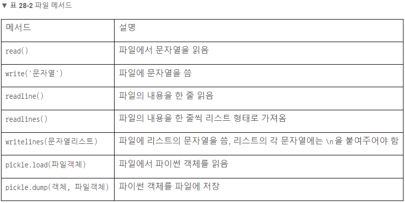

# File 

### 파일에 문자열 쓰기
- 파일 = open(파일이름, 파일모드)
- 파일.write(’문자열’)
- 파일.close()
```python
file = open('hello.txt', 'w')  # hello.txt 파일을 쓰기 모드(w)로 열기
file.write('Hello, world!')  # 파일에 문자열 저장
file.close()  # 파일 닫기
```

### 파일에서 문자열 읽기
- 변수 = 파일.read()
```python
file = open('hello.txt', 'r')
s = file.read()
print(s)  # Hello, world!
file.close()
```

### 자동으로 파일 닫기
- with open(파일이름, 파일모드) as 파일객체:
```python
with open('hello.txt', 'r') as file:
	s = file.read()
	print(s)  # Hello, world!
```

### 반복문으로 문자열 여러 줄 파일에 쓰기
```python
with open('hello.txt', 'w') as file:
	for i in range(3):
		file.write(f'Hello, world! {i}\n')
```

### 리스트에 들어있는 문자열을 파일에 쓰기
```python
lists = ["안뇽\n", "파이썬\n", "코딩\n"]
with open('hello.txt', 'w') as file:
	file.writelines(lists)
```

### 파일의 내용을 한 줄씩 리스트로 가져오기
```python
with open('hello.txt', 'r') as file:
	lines = file.readlines()
	print(lines)  # ['안뇽\n', '파이썬\n', '코딩\n']
```

### 파일의 내용을 한 줄 읽기
- 변수  = 파일.readline()
=== "for"
    ``` python
    with open('hello.txt', 'r') as file:
        for line in file:
            print(line.strip('\n'))
    ```
=== "while"
    ``` python
    with open('hello.txt', 'r') as file:
        line = None
        while line != '': #readline은 더 이상 읽을 줄이 없을 때 빈 문자열을 반환함을 이용
            line = file.readline()
            print(line.strip('\n')) #파일에서 읽어온 문자열에서 \n 삭제하여 출력
    ```

### ** 파일 객체는 이터레이터
따라서, 변수 여러 개에 저장하는 언패킹도 가능
```python
file = open('hello.txt', 'r')
a,b,c = file
```

### File Mode


### File Method
