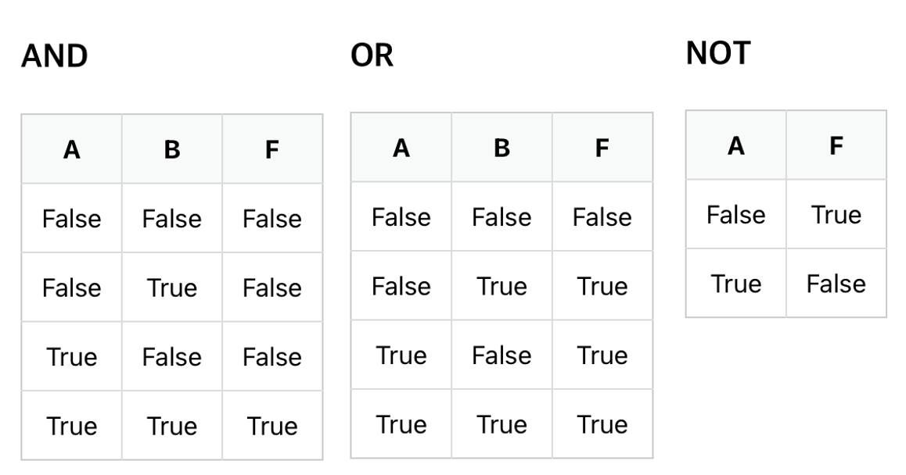

# 연산자 Operator

### 논리연산자 AND, OR, NOT



- AND : 데이터 2개가 모두 True인 경우에 True 반환
- OR : 데이터가 1개라도 True이면 True 반환
- NOT : True면 False 반환, False면 True 반환
``` python
a = 0 # False
b = 1 # True

print(bool(a and b)) # False
print(bool(a or b)) # True
print(not a) # True
```

### 산술연산자

### 비교연산자

### 할당연산자

### 비트연산자

### Idenriry 연산자


!!! quote
    [파이썬 헤엄치기](https://wikidocs.net/96000)