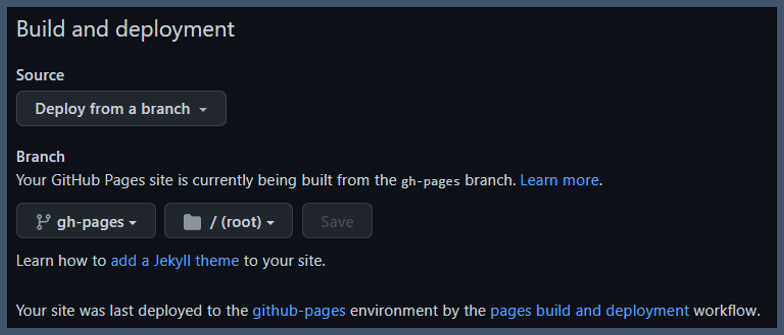

# Material for MKdocs + Github pages
!!!info
    - Material for MKdocs Getting Started :material-arrow-right-bold:
    [MKdocs-Link](https://squidfunk.github.io/mkdocs-material/getting-started/)
    - Github Pages Quick start :material-arrow-right-bold:
    [Github-pages-Link](https://docs.github.com/ko/pages/quickstart)

## Material for MKdocs
1. Install and Create
```bash
pip install mkdocs-material
mkdocs new
```
```bash
# Create structure
.
├─ docs/
│  └─ index.md
└─ mkdocs.yml
```
2. Set up the Minimal configuration
```yaml title="mkdocs.yml"
theme:
    name: material
```
3. Verify that you can run mkdocs-web using localhost
```bash
mkdocs serve
```

## Github Pages
1. with GitHub Actions  
You Copy the ci.yml :material-arrow-right-bold: [Copy-Link](https://squidfunk.github.io/mkdocs-material/publishing-your-site/#github-pages)  
And paste ./github/workflows/ci.yml
```bash
mkdir .github/workflows
cd .github/workflows
#Paste ci.yml
vi ci.yml 
```
2. Github push  
3. Set up Github Pages <div>
    - Under your Mkdocs Repository name, click :simple-gotomeeting:Settings.
    {: style="height:60%;width:60%"}  
    - In the "Code and automation" section of the left sidebar, click :octicons-note-16:Pages.  
    - Build and deployment  
    {: style="height:60%;width:60%"}
        + Source: Select **Deploy from a branch**  
        + Branch: use the **gh-pages Branch** and select a publishing source.
    - Visit your new website  
     