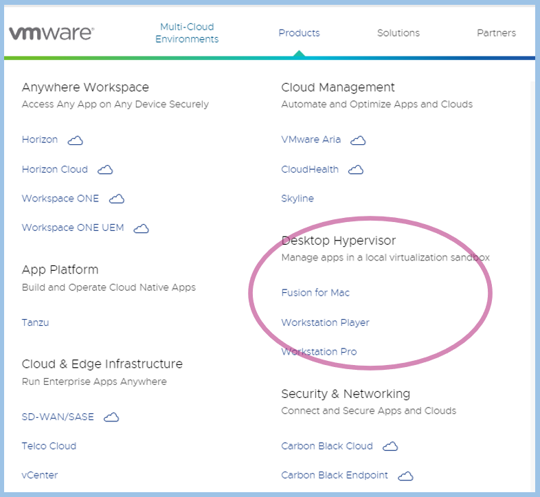
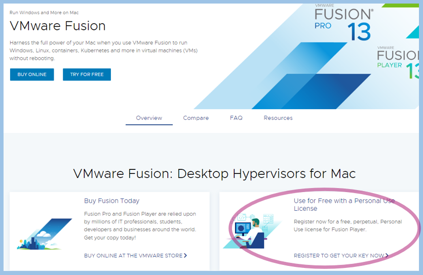
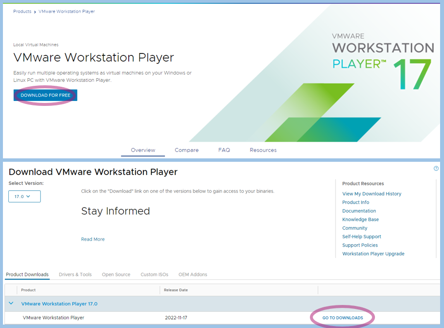
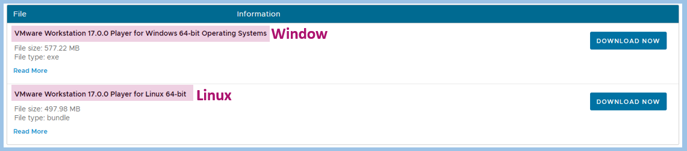
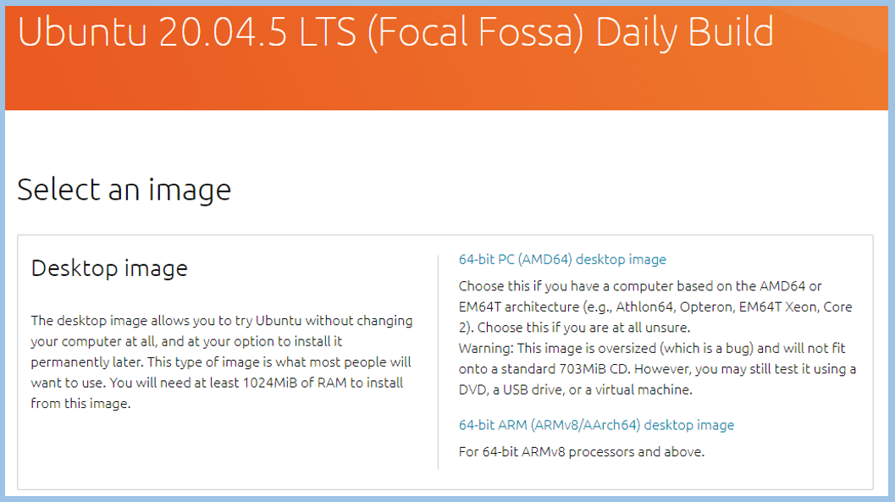

# Install Ubuntu On Local Using VMware Workstation Player

## Install VMware
**1. Connect** [VMware Link](https://www.vmware.com/products/workstation-player.html)     
**2. Select a hypervisor based on your local OS**    
⋅⋅* Mac : Fusion for Mac  
⋅⋅* Window or Linux : Workstation Player       
{: style="height:60%;width:60%"}  

**3. Install** 

* If you use the Mac:    
Click Use for Free with a Personal Use License   
{: style="height:60%;width:60%"}  

- If you use the Window or Linux:  
Click **PINK CIRCLE** and **DOWNLOAD** for your OS   
{: style="height:60%;width:60%"}  
{: style="height:60%;width:60%"}  

## Install Ubuntu on VMware
I'm use Ubuntu 20.04.5 :material-arrow-right-bold: [Ubuntu-Link](https://cdimage.ubuntu.com/focal/daily-live/current/)   
{: style="height:60%;width:60%"}

* If you use the Mac:   
Click 64-bit ARM (ARMv8/AArch64) desktop image   
- If you use the Window or Linux:  
Click 64-bit PC (AMD64) desktop image 