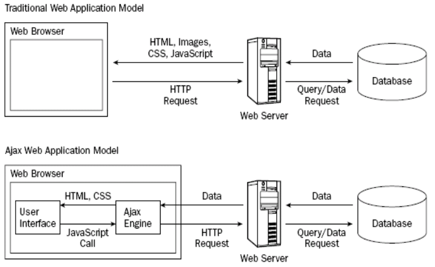
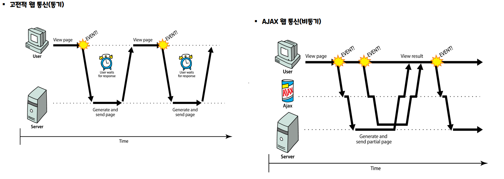
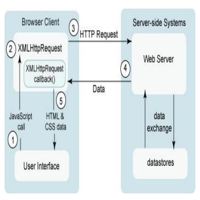

# AJAX
: Asynchronous JavaScript and XML
<br> Reload(=refresh 재갱신)하지 않고, 웹페이지의 일부만을 갱신하여 웹서버와 데이터를 교환하는 방법. 빠르게 동적 웹페이지를 생성하는 기술이다

- 고전적 웹 통신과 AJAX 웹 통신


- 동기/비동기


## AJAX의 동작과정


1. 이벤트 발생에 의해 이벤트핸들러 역할의 JavaScript 함수를 호출
2. 핸들러 함수에서 XMLHttpRequest 객체를 생성한다. 요청이 종료되었을 때 처리할 기능을 콜백함수로 만들어 등록한다.
3. XMLHttpRequest 객체를 통해 서버에 요청을 보낸다.
4. 요청을 받은 서버는 요청 결과를 적당한 데이터로 구성하여 응답한다.
5. XMLHttpRequest 객체에 의해 등록된 콜백함수를 호출하여 응답 결과를 현재 웹 페이지에 반영한다.


## XMLHttpRequest 객체 생성

=== "Example"
    ``` html
    <script>
    function requestAjax() {
        const xhr = new XMLHttpRequest(); // 객체 생성
        xhr.onload = function () { // onreadystatechange = 함수 (Event-Handler 등록)
            const result = document.getElementById("result");
            result.innerHTML += xhr.responseText + "<hr>"; //현재 페이지에 내용 붙이기		
        }
        xhr.open("GET", "/edu/first.html", true);  // GET, POST, HEAD, PUT, DELETE
        xhr.send();
    }
    </script>
    ```
=== "Example-JSON"
    ``` html
	<script>
    function requestAjax() {
        const xhr = new XMLHttpRequest();
        xhr.onload = function () {
            const result = document.getElementById("result");
            const jsonObj = JSON.parse(xhr.responseText);
            result.innerHTML += "<h2>"+jsonObj.LampScpgmtb.RESULT.MESSAGE+"</H2>";	
            const target = jsonObj.LampScpgmtb.row;				
            for(let i in target) {					
                result.innerHTML += "<h3>"+target[i].UP_NM+"</H3>";
                result.innerHTML += "<h4>"+target[i].PGM_NM+"</H4>";
            }
            result.innerHTML += "<hr>";
        }
        xhr.open("GET", "http://openapi.seoul.go.kr:8088/796143536a756e69313134667752417a/json/LampScpgmtb/1/3/", true);
        xhr.send();
    }
	</script>
    ```
=== "Example-POST"
    ``` html
        <script>
        window.addEventListener("load", function() {
            document.getElementById("loginb").onclick = handleButtonPress;
        });
        let xhr;
        let id, form;
        function handleButtonPress(e){
            e.preventDefault();
            xhr =  new XMLHttpRequest();
            form = document.querySelector("#loginf");
            id = document.querySelector("#id");
            const passwd = document.querySelector("#passwd");
            const queryString = `id=${id.value}&passwd=${passwd.value}`;
            xhr.addEventListener("load", handleResponse);
            xhr.open("POST", form.action, true);
            xhr.setRequestHeader("Content-type", "application/x-www-form-urlencoded");
            xhr.send(queryString);
        }
        function handleResponse() {
            const jsonObj = JSON.parse(xhr.responseText);
            const output = document.querySelector("output");
            if (jsonObj.result == "ok") {
                output.textContent="로그인 성공!!";
                output.style.color = "blue";
            } else if (jsonObj.result == "fail") {
                output.textContent="로그인 실패!!";
                output.style.color = "red";
                form.reset();
                id.focus();
            }
        }								
        </script>
    ```

## fetch() 함수 이용
: ECMA6~

## axios 추가 라이브러리 이용

---
## XML vs JSON