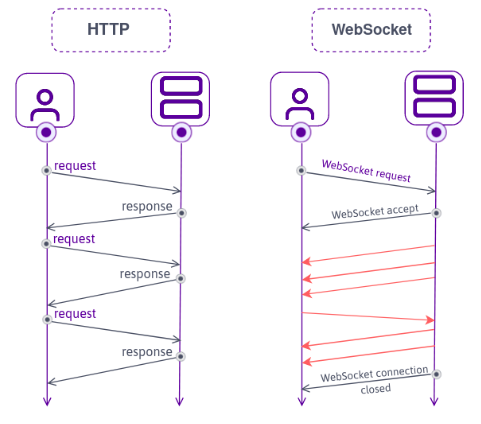

# WEB

## WWW이란?
: World Wide Web
  인터넷에 연결된 컴퓨터를 통해 전세계 사람들이 정보를 공유할 수 있는 사이버 공간
  1989년 3월 영국의 유럽 입자 물리 연구소의 공학자 팀 버너스리의 제안에 의해 연구/개발 시작

- 인터넷 : 1960년대 미국 국방부의 ARPA에서 시작된, TCP/IP 통신 규약을 통해 데이터를 주고 받는 컴퓨터 네트워크
- Web : 전자 메일과 같이 인터넷 상에서 동작하는 하나의 서비스   인터넷에서 HTTP 프로토콜, 하이퍼텍스트, HTML 형식 등을 사용하여 그림과 문자를 교환하는 전송방식
- 웹브라우저 : 웹사이트에 구축된 웹페이지. HTML 문서를 볼 수 있는 응용 프로그램 (크롬, 파이어폭스 등)
- 웹 서버 : 인터넷을 통해 사용자에게 웹서비스를 제공하는 컴퓨터의 HW/SW
- 클라이언트 : 웹서비스를 이용하는 사용자
- 웹 호스팅 : 전문 업체에서 자신의 웹 서버와 네트워크를 이용하여 개인/기관에게 홈페이지를 구축할 수 있도록 디스크 공간을 임대해주는 서비스
- 웹 페이지 : 웹 브라우저 화면에서 보이는 각각의 화면. HTML, CSS, JS 등의 프로그램 소스파일과 데이터 파일로 구성
- 웹 사이트 : 도메인 네임에 구축된 웹 페이지 묶음

## 웹표준
: W3C 조직에서 정한 표준기술만을 사용하여, 웹 페이지 작성시 문서의 구조와 표현 방법 그리고 상호 동작을 구분하여 구현하는 것

---
## 웹소켓 WebSocket
: HTML5 표준 기술, HTTP 환경에서 클라이언트와 서버 사이에 하나의 TCP 연결을 통해 실시간으로 전이중 통신을 가능케 하는 프로토콜

- 실시간 채팅 등 실시간이라는 키워드가 들어가는 기능들을 위해서는 대부분 웹소켓 기술이 필요하다
- 전이중 통신 : 단방향 통신과 달리 양방향으로 송신과 수신이 가능한 것

### 통신 방식

- 전이중 통신이므로, 연속적인 데이터 전송의 신뢰성을 보장하기 위해 Handshake 과정 수행
- 기존의 다른 TCP 기반의 프로토콜은 TCP layer에서의 Handshake를 통해 연결을 수립하는 반면, 웹 소켓은 **HTTP 요청 기반으로 Handshake** 과정을 거쳐 연결을 수립

---
!!! quote
    - HTML/CSS 입문 예제 중심 (지은이: 황재호 | 출판사: 인포앤북(주))
    - 김정현 강사님