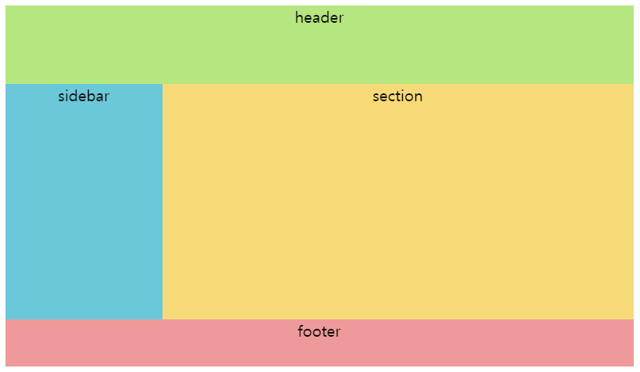
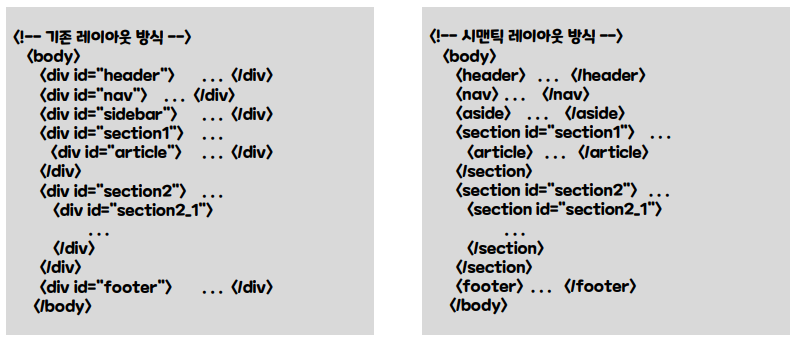
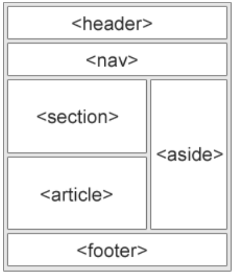

# HTML, CSS - Web Page Layout

## 박스 요소의 중앙 배치
- `margin: 0 auto;` : 상하단 마진은 0, 좌우측 마진은 auto = 박스 중앙 배치
- `text-align: right;` : 우측 정렬
- `text-align: center;` : 가운데 정렬
- `height: 100px` = `line-height: 100px` : 둘을 같은 크기로 선언하면 상하 중앙에 배치
``` html
<head>
    <meta charset="utf-8">
    <title>TITLE</title>
    <style>
        #box {
            margin: 0 auto; 
            background-color: red;
        }
        #box2 {text-align: right;}
    </style>
</head>
<body>
    <div id="box">
        안녕하세요
    </div>
</body>
```

---
## float 
: 웹 페이지의 요소를 공중에 띄워 화면의 좌측 또는 우측에 배치 가능

- `float: left;` : 요소를 공중에 띄워 좌측에 배치
- `float: right` : 요소를 공중에 띄워 우측에 배치
- `both` : 이전에 사용된 float 속성 값 left와 right의 기능 둘 다 해제
- `clear` : 한 요소에 float 속성이 적용되면, 다음 요소들도 계속해서 float의 영향을 받게 된다. 영향에서 벗어나 새로운 줄에 배치하고자 할 때 사용
- float 속성이 적용되지 않은 a,b : display 속성의 기본값인 블록 방식이 적용됨
``` html
<head>
    <meta charset="utf-8">
    <title>TITLE</title>
    <style>
        div {float:left;}
        h3 {clear:both;}
    </style>
</head>
<body>
    <div></div>
    <h3>안녕하세욥</h3> <!-- 해당 단락은 이미지 박스 다음의 새로운 줄에서 시작 -->
</body>
```
---
## div 요소 레이아웃
``` html
<head>
    <meta charset="utf-8">
    <style>
        #a { width: 800px; margin: 0 auto;}
        #header { height: 100px; background-color: hsl(88, 67%, 70%);}
        #sidebar { float: left; width: 200px; height: 300px; background-color: hwb(189 42% 15%);}
        #section {float: right; width: 600px; height: 300px; background-color: hwb(46 47% 3%);}
        #footer {clear: both; height: 60px; background-color: rgba(236, 144, 144, 0.904);}

        #a,#header,#sidebar,#section,#footer {font-size: 20px; text-align: center;}
    </style>
</head>
<body>
    <div id="a">
        <div id="header">header</div>
        <div id="sidebar">sidebar</div>
        <div id="section">section</div>
        <div id="footer">footer</div>
    </div>
</body>
```
{:style width=80%;height=70%}

---
## HTML 레이아웃 요소 :star:
- 기존 레이아웃 방식
    - 모든 레이아웃 영역에 `<div>` 태그 사용 -> 세부적인 구별이 어려움
    - `<div>` 태그의 id 속성값으로 의미를 표시하거나 class 속성값으로 의미 표현
- 시맨틱 레이아웃 방식
    - 레이아웃 영역을 시맨틱 태그를 이용하여 구분
    - `<div>` 대신 여러 시맨틱 태그로 표시
    - 표준 시맨틱 태그로 정의함으로써 문서의 의미 구조를 명확하고 간결하게 표현하도록 개선



### 시맨틱 레이아웃
- `<body>`
    - `<header>` : 주로 머리말, 제목 표현
    - `<section>` : 본문 콘텐트 담당
    - `<footer>` : 하단 푸터, 회사소개/저작권/약관/제작정보 등 (연락처는 `<address>`)
- `<nav>` : 네비게이션. 콘텐츠를 담고 있는 문서를 사이트간에 서로 연결하는 링크 역할 담당 <br> 위치에 영향을 받지 않아 어디에서든 사용 가능
- `<article>` : 실질적인 내용 (ex. 뉴스에서 정치/사회 대분류는 section, 기사내용은 article)
- `<aside>` : 본문 이외의 내용을 담는 사이드바. 주로 광고나 링크
- `<div>` : HTML5에 와서는 글자나 사진등의 콘텐트들을 묶어서 CSS 스타일을 적용시킬 때 사용


``` html
<head>
    <meta charset="utf-8">
    <title>TITLE</title>
    <style>
        a { width: 800px; margin: 0 auto;}
        header { height: 100px; background-color: hsl(88, 67%, 70%);}
        aside { float: left; width: 200px; height: 300px; background-color: hwb(189 42% 15%);}
        section {float: left; width: 600px; height: 300px; background-color: hwb(46 47% 3%);}
        footer {clear: both; height: 60px; background-color: rgba(236, 144, 144, 0.904);}
        header,aside,section,footer {font-size: 20px; text-align: center;}
    </style>
</head>
<body>
    <div id="a">
        <header>header</header>
        <aside>sidebar</aside>
        <section>section</section>
        <footer>footer</footer>
    </div>
</body>
```
---
## 요소의 위치 지정
- position : HTML 요소의 위치 지정 (float는 화면의 좌/우측에 배치)
    - `position: relative;` : 상대 위치 지정. 요소의 원래 위치에서 지정한 만큼 이동한 지점에 배치
    - `position: absolute;` : 절대 위치 지정. 브라우저의 좌측 상단 시작점(기본 마진 제외)에서 지정한 만큼 이동한 지점에 배치
    - 부모 요소(relative) + `position: absolute;` : 부모 요소의 원점을 기준으로 요소 배치
    - `position: fixed;` : 웹 페이지의 특정 위치에 고정
``` html
<head>
    <meta charset="utf-8">
    <title>TITLE</title>
    <style>
        #a { position: relative; left:60px; top: 60px; width: 800px; height: 500px; }
        #b { position: absolute; left: 70px; top: 60px; width: 800px; height: 500px; }
        #parent { position: relative; width: 800px; height: 500px; }
        #d { position: fixed; right: 70px; top: 60px; width: 800px; height: 500px; }

    </style>
</head>
<body>
    <div id="a">상대위치 A</div>
    <div id="b">절대위치 B</div>
    <div id="parent">
        <div id="b">부모가 있는 절대위치 B</div>
    </div>
    <div id="d">고정위치 D</div>
</body>
```
---
## box-sizing
: 패딩과 경계선 설정이 요소에 사용되더라도 width와 height 속성에 의해 설정된 박스의 크기는 그대로 유지
<br> 요소에 패딩과 경계선이 적용되면서 박스의 크기가 커지는 단점 보완

---
## 전체 페이지 레이아웃

1. 박스 형태로 구획 나누기 (Ex. 상단 헤더, 메인 이미지, 사이드바, 메인 섹션, 하단 푸터)
2. 소스 파일 정리
    - layout.html : 전체 페이지 레이아웃 (마진 패딩 초기화, header 높이 설정, box의 중앙 배치와 너비 설정 등)
    - header.html : 상단 헤더 (마진 패딩 초기화, box-sizing)
    - mainimage.html : 메인 이미지
    - header-mainimage.html : 헤더+메인 이미지
    - sidebar.html : 사이드바
    - main.html : 메인 섹션
    - footer.html : 하단 푸터
    - index.html : 완성된 웹 페이지

---
## 반응형 웹

---
!!! quote
    - HTML/CSS 입문 예제 중심 (지은이: 황재호 | 출판사: 인포앤북(주))
    - openAI
    - [W3Schools](https://www.w3schools.com/html/html_layout.asp)