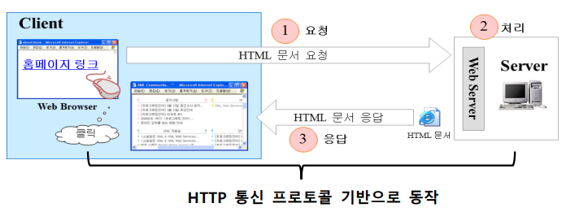

# HTTP (Hypertext Transfer Protocol)
: 웹 통신에 사용되는 표준 통신 프로토콜
  웹 클라이언트와 서버 사이에 이루어지는 request/response에 대한 프로토콜
 :star: **Connection Oriented, Stateless** 방식으로 동작

## HTTP Method

|  요청방식  |        설명        |
| :-------: | :----------------: |
| **GET**  | 조회, URI에 지정된 웹문서의 내용을 요구할 때 사용되는 요청 방식   name=value로 구성되는 간단한 데이터(Query 문자열)를 URI 뒤에 추가하여 전달하면서 요청하고자 하는 경우에도 사용 |
| **POST** | 생성, 원하는 방식으로 인코딩 된 데이터를 요청 바디에 포함하여 전송하면서 파일을 요청하고자 하는 경우 사용 |
| PUT      | 수정, PUT을 통해 해당 리소스의 전체 정보를 수정 |
| DELETE   | 삭제, DELETE를 통해 리소스 삭제 |
| HEAD     | Header 정보 조회, |
| PATCH | 부분 수정, PUT을 통해 해당 리소스의 부분 정보를 수정 |
| OPTIONS  | | 
| TRACE    | |

1. 클라이언트가 서버에 연결
2. 클라이언트가 서버로 HTTP request 전송   이때의 request는 Requst Header도 함께 전송 
3. 서버가 클라이언트에게 HTTL Response 전송   이때의 response 정보는 Response Header에, 데이터는 Response Body에 포함

## SOP (Same Origin Policy)
: 브라우저에서 보안상의 이슈로 **동일 사이트의 자원(resource)만 접근**해야 한다는 제약

## CORS (Cross Origin Resource Sharing)
: Origin이 아닌 다른 사이트의 자원을 접근하여 사용한다는 의미 

- AJAX : `response.addHeader("Access-Control-Allow-Origin", "*");`

---
!!! quote
    - 김정현 강사님
    - 쉽게 배우는 데이터 통신과 컴퓨터 네트워크 (지은이: 박기현 | 출판사: 한빛아카데미)